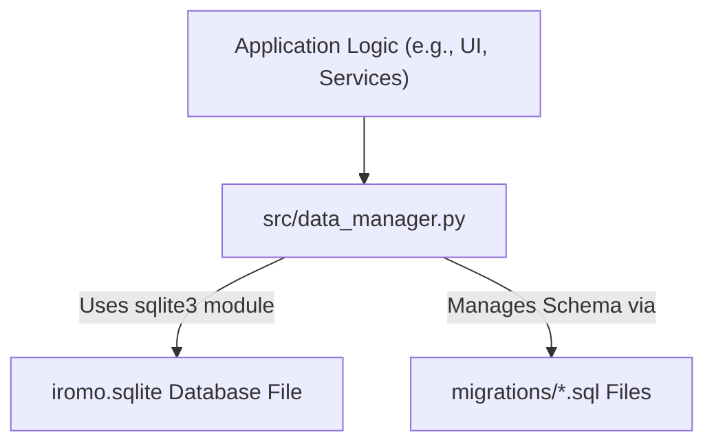

# Iromo Project: Database Architecture Plan

**Date:** 2025-05-21

**Status:** Approved

## 1. Core Decision: Utilize Standard `sqlite3` Library

The Iromo project will continue to utilize the standard Python `sqlite3` library for all database interactions with the `iromo.sqlite` database file. This decision prioritizes simplicity, minimal external dependencies, and direct control over SQL operations.

## 2. Rationale

*   **Simplicity & Minimal Dependencies:** The `sqlite3` library is built into Python, eliminating the need for additional external libraries. This simplifies project setup, dependency management, and deployment.
*   **Direct SQL Control:** This approach provides full control over the SQL queries, allowing for fine-tuning and optimization as needed.
*   **Sufficiency for Current & Foreseeable Needs:** The current database schema (as defined in `migrations/001_initial_schema.sql`) is well-structured, and `sqlite3` is capable of handling the existing and anticipated data relationships and query patterns.
*   **Existing Solid Foundation:** The code in `src/data_manager.py` already demonstrates a robust and well-organized approach to direct SQL interaction.

## 3. Key Advantages of This Approach

*   **No External Dependencies:** Reduces potential points of failure or version conflicts associated with third-party libraries.
*   **Performance:** Direct SQL can be highly performant, and for SQLite, the overhead of an ORM might not always be justified for the project's scale.
*   **Widely Understood:** Standard SQL and the `sqlite3` module are common knowledge for many Python developers.

## 4. Recommended Best Practices & Considerations

To ensure the continued success and maintainability of this approach, the following practices should be adhered to:

*   **Consistent Connection Handling:**
    *   Continue using the `get_db_connection()` function for establishing database connections.
    *   Ensure connections are reliably closed after use (e.g., via `try...finally` blocks or by ensuring each function that opens a connection also closes it).
*   **Security (Prevent SQL Injection):**
    *   **Critically Important:** Always use parameterized queries (e.g., `cursor.execute("SELECT * FROM topics WHERE id = ?", (topic_id,))`) for any SQL query that incorporates variable data. Do not use string formatting or concatenation to build SQL queries with external input.
*   **Migration Management:**
    *   Continue the current system of using ordered SQL script files stored in the `migrations/` directory.
    *   Track applied migrations in the `schema_migrations` table.
    *   All schema changes must be introduced via new, clearly documented migration files.
*   **Error Handling:**
    *   Implement comprehensive `try...except sqlite3.Error as e:` blocks for all database operations.
    *   Handle exceptions gracefully, including logging errors and using `conn.rollback()` to undo changes in case of failure during a transaction.
*   **Code Organization:**
    *   Maintain clear and well-documented functions within `src/data_manager.py`.
    *   If `src/data_manager.py` grows excessively large, consider refactoring into more focused modules, though it is currently manageable.
*   **Transaction Management:**
    *   Use `conn.commit()` explicitly after a sequence of data-modifying operations that form a logical unit of work.
    *   Use `conn.rollback()` within error handling blocks to ensure atomicity and data integrity.
*   **Testing:**
    *   Develop and maintain a suite of tests for the data access functions in `src/data_manager.py`.
    *   Consider using an in-memory SQLite database (`:memory:`) for faster and isolated test runs.

## 5. Conceptual Architectural Overview

## 6. Future Considerations

While the `sqlite3` approach is suitable now, if the project's data model or query complexity significantly increases in the future, the decision to introduce an ORM (Object-Relational Mapper) like SQLAlchemy or Peewee could be revisited. However, for the current scope and preference for simplicity, direct `sqlite3` usage is the approved path.