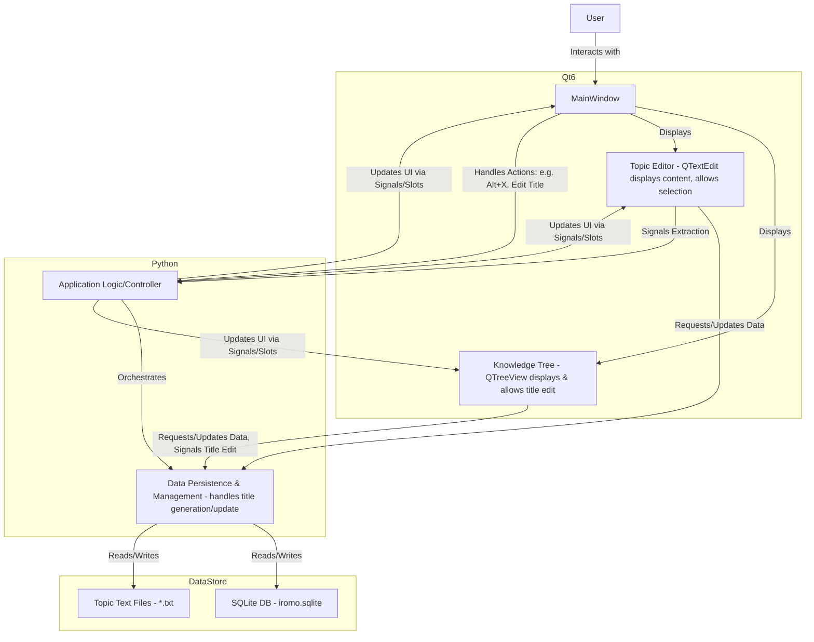

# Iromo - MVP Plan

**Project Name:** Iromo
**Core Technology:** Python & Qt6

**MVP Goal:** Implement a system with a hierarchical Knowledge Tree (KT) where users can add topics, paste text into them, and extract portions of that text into new child topics. Extracted text in the parent should be visually highlighted. Topic titles will initially be the first X characters of their content, editable by the user.

---

**I. Data Storage and Structure**

1.  **Topic Content Files:**
    *   Each topic's primary text content will be stored in a separate plain text file (e.g., `.txt`).
    *   All these text files will reside in a single dedicated data directory (e.g., `iromo_data/text_files/`).
    *   Files will be named using unique identifiers (UUIDs) to prevent naming conflicts and simplify linking from the database (e.g., `abcdef12-3456-7890-abcd-ef1234567890.txt`).

2.  **SQLite Database (`iromo.sqlite`):**
    *   This database will be the central hub for managing metadata, the KT structure, extraction information, and eventually, other features like search indexes and statistics.
    *   **Core Tables:**
        *   `topics`:
            *   `id` (TEXT, PRIMARY KEY, UUID) - Unique identifier for the topic.
            *   `parent_id` (TEXT, FOREIGN KEY referencing `topics.id`, NULLable for root topics) - Defines the hierarchy.
            *   `title` (TEXT) - The title of the topic. Initially the first X characters of the topic's content, user-editable.
            *   `text_file_uuid` (TEXT, UNIQUE) - The UUID part of the filename for the topic's content (e.g., `abcdef12-3456-7890-abcd-ef1234567890`).
            *   `created_at` (TIMESTAMP)
            *   `updated_at` (TIMESTAMP)
            *   `display_order` (INTEGER, optional) - To maintain a specific order of children under a parent, if needed beyond creation time.
        *   `extractions`:
            *   `id` (TEXT, PRIMARY KEY, UUID)
            *   `parent_topic_id` (TEXT, FOREIGN KEY referencing `topics.id`) - The topic from which text was extracted.
            *   `child_topic_id` (TEXT, FOREIGN KEY referencing `topics.id`, UNIQUE) - The new topic created with the extracted text.
            *   `parent_text_start_char` (INTEGER) - Start character offset of the extraction in the parent topic's text.
            *   `parent_text_end_char` (INTEGER) - End character offset of the extraction in the parent topic's text.

3.  **Highlighting Mechanism:**
    *   The "light blue background" for extracted text in the parent topic will be managed dynamically by the UI.
    *   When a topic's text is loaded into the editor, the application will query the `extractions` table for all entries where the current topic is the `parent_topic_id`.
    *   For each found extraction, the `parent_text_start_char` and `parent_text_end_char` will be used to apply a background color format to that segment of text in the Qt text editor widget.

**II. Application Architecture (High-Level Components)**

**III. MVP Feature Breakdown & Development Steps**

1.  **Project Setup & Basic Window:**
    *   Set up Python project environment.
    *   Install `PyQt6`.
    *   Create the main application window class.
    *   Basic menu bar / ribbon placeholder.

2.  **Data Manager Implementation:**
    *   Python module to handle all interactions with `iromo.sqlite` and text files.
    *   Functions for:
        *   Initializing the database and creating tables.
        *   Creating a new topic (DB entry + new empty `.txt` file, initial title generation).
        *   Fetching topic hierarchy.
        *   Fetching/Saving topic text content.
        *   Recording an extraction (new child topic, entry in `extractions` table).
        *   Fetching extraction data.
        *   Updating topic titles.

3.  **Knowledge Tree Widget:**
    *   Custom widget using `QTreeView`.
    *   Load and display topic hierarchy.
    *   Handle selection changes.
    *   Allow inline editing of topic titles, persisting changes via `DataManager`.

4.  **Topic Editor Widget:**
    *   Custom widget using `QTextEdit`.
    *   Load topic text content.
    *   Apply highlighting for existing extractions.
    *   Allow text pasting and editing.
    *   Save changes back to the text file.

5.  **Extraction Logic (`AppLogic`):**
    *   Implement the "extract" action.
    *   Get selected text and character offsets.
    *   Instruct `DataManager` to create a new child topic (with its initial title) and record the extraction.
    *   Refresh the `KnowledgeTreeWidget`.
    *   Re-apply highlighting in the `TopicEditorWidget` for the parent topic.

6.  **Connecting Components:**
    *   Use Qt's signals and slots mechanism.

**IV. Cloud Sync Consideration (Minimal for now)**

*   The use of UUIDs for topic IDs is a good first step.
*   Ensuring `created_at` and `updated_at` timestamps are reliably managed.
*   No specific cloud sync architecture will be implemented in the MVP.