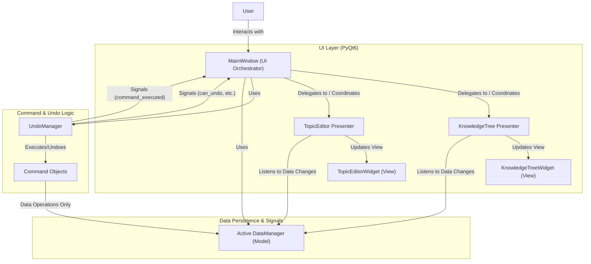

## Iromo Application Architecture Review & Suggestions Plan

### I. Current Architecture Overview

Your Iromo application generally follows a Model-View-Controller (MVC)-like pattern, leveraging the Command pattern for operations and undo/redo functionality.

*   **Core Components:**
    *   **`MainWindow` ([`src/main_window.py`](src/main_window.py)):** Central UI orchestrator and controller.
    *   **`DataManager` ([`src/data_manager.py`](docs/project_brief.md:103)):** Handles data persistence.
    *   **UI Widgets ([`src/knowledge_tree_widget.py`](docs/project_brief.md:115), [`src/topic_editor_widget.py`](docs/project_brief.md:124)):** Specialized Qt widgets for display and editing.
    *   **Commands ([`src/commands/topic_commands.py`](src/commands/topic_commands.py), [`src/commands/base_command.py`](src/commands/base_command.py)):** Encapsulate operations, currently interacting with both `DataManager` and UI widgets.
    *   **`UndoManager` ([`src/undo_manager.py`](src/undo_manager.py)):** Manages undo/redo stacks and command execution.

*   **Interaction Flow (Example: Create Topic):** User action in `MainWindow` -> `MainWindow` creates Command -> `UndoManager` executes Command -> Command interacts with `DataManager` (data) and UI Widgets (view).

*   **Mermaid Diagram (Current Architecture):**

    ```mermaid
    graph TD
        User -->|Interacts with| MainWindowUI["MainWindow (UI, Controller Logic)"]
        
        MainWindowUI -->|Creates & Dispatches to| UndoManager
        MainWindowUI -->|Instantiates & Uses| ActiveDM["Active DataManager (Model Logic)"]
        
        UndoManager -->|Executes/Undoes| CommandObjects["Command Objects (e.g., CreateTopicCommand)"]
        
        CommandObjects -->|Data Operations| ActiveDM
        CommandObjects -->|Direct UI Updates| KnowledgeTreeWidgetUI["KnowledgeTreeWidget (View)"]
        CommandObjects -->|Direct UI Updates| TopicEditorWidgetUI["TopicEditorWidget (View)"]
        
        MainWindowUI -->|Owns & Displays| KnowledgeTreeWidgetUI
        MainWindowUI -->|Owns & Displays| TopicEditorWidgetUI
        
        KnowledgeTreeWidgetUI -- Signals (e.g., topic_selected) --> MainWindowUI
        TopicEditorWidgetUI -- Provides Data / Signals --> MainWindowUI
        UndoManager -- Signals (e.g., can_undo_changed, command_executed) --> MainWindowUI
        
        subgraph UI_Layer ["UI Layer (PyQt6)"]
            MainWindowUI
            KnowledgeTreeWidgetUI
            TopicEditorWidgetUI
        end
    
        subgraph Command_Logic ["Command & Undo Logic"]
            UndoManager
            CommandObjects
        end
    
        subgraph Data_Layer ["Data Persistence"]
            ActiveDM
        end
    ```

### II. Strengths of Current Architecture

*   Clear data persistence layer (`DataManager`).
*   Effective undo/redo mechanism.
*   Modular UI widgets.
*   Good use of Qt signals/slots.
*   Collection-oriented design.

### III. Areas for Improvement

*   **Tight Coupling:** Commands are tightly coupled with UI widgets.
*   **`MainWindow` Responsibilities:** `MainWindow` has many responsibilities.
*   **UI Update Logic Distribution:** UI update logic is spread out.
*   **Testability Concerns:** Coupling and broad responsibilities impact testability.

### IV. Proposed Suggestions

1.  **Decouple Commands from UI Widgets:**
    *   Commands should only interact with `DataManager`.
    *   UI updates via:
        *   **Data-driven Signals from `DataManager` (Preferred):** `DataManager` emits signals on data changes; `MainWindow` or Presenters update UI.
        *   **Enhanced Command Signals from `UndoManager`:** `UndoManager` signals carry more data for `MainWindow` to update UI.
2.  **Refine `MainWindow`'s Role (Consider Presenters/ViewModels):**
    *   Introduce Presenter classes (e.g., `KnowledgeTreePresenter`, `TopicEditorPresenter`) to manage UI logic for specific widgets, reducing `MainWindow`'s load.
3.  **Centralize and Standardize UI Updates Post-Command Execution:**
    *   Use `DataManager` signals or `UndoManager` signals consistently to trigger UI refreshes.
4.  **Commands as Data Carriers for Undo/Redo UI Updates:**
    *   Commands store state for `undo()` data operations. For UI reversion, `UndoManager` signals can pass command details for `MainWindow`/Presenters to use.

### V. Illustrative Mermaid Diagram (Proposed - with Decoupled Commands & Presenters)



### VI. Benefits of Proposed Changes

*   Improved Separation of Concerns.
*   Enhanced Testability.
*   Increased Maintainability & Scalability.
*   Reduced Complexity in Key Components.